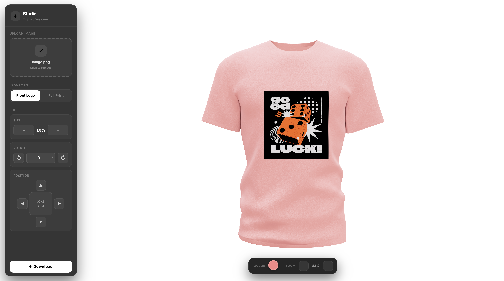

# 3D T-Shirt Customizer

Custom 3D T-Shirt designer. Design your own T-shirts from scratch, customize its colors and logo. Made using ThreeJS, ReactJS and Custom Hooks.

## Features

- Create your own T-shirt designs from scratch
- Customize everything from color to logo to background as per your wish
- See your changes real time through a 3D model
- Add your own files to customize logo and background of your T-shirt
- Download a png image of your customized T-shirt

## Tech Stack

- HTML, CSS, JavaScript
- ReactJS
- ThreeJS
- Tailwind CSS
- Framer Motion
- Valtio
- ViteJS

## Prerequisites

- Git
- Node

## Installation

1. Fork the project
2. Clone the project: `git clone https://github.com/deepak-Balakrishnan23/3d-Tshirt-.git`
3. Navigate to the project directory: `cd 3d-Tshirt-`
4. Install dependencies: `npm install`
5. Start the dev server: `npm run dev`

## Contributing

Contributions make the open source community such an amazing place to learn, inspire and create. Any contributions you make are greatly appreciated.

## License

Distributed under the MIT License. See LICENSE for more information.
